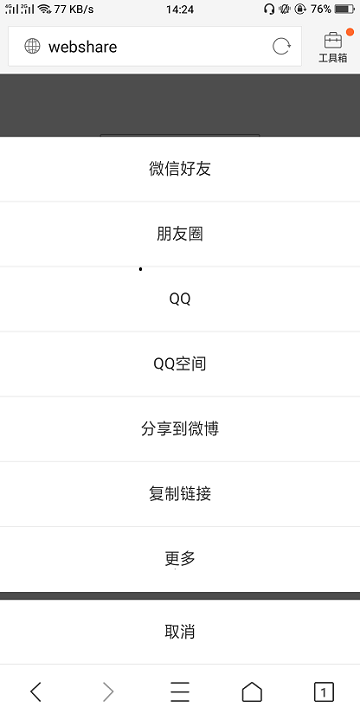
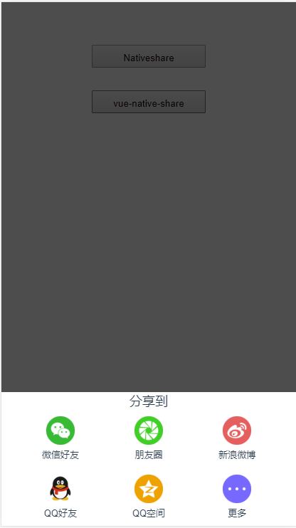

## webapp调起浏览器分享

### 起因

> 最近在做一个新闻资讯页，有分享的功能，在参考了很多的资料后，有以下总结。

### 兼容性

- **移动端几乎所有浏览器都支持分享到QQ和QQ空间**
- QQ浏览器
- UC浏览器
- 微信自带浏览器
- QQ自带浏览器
- QQ空间APP
- 百度浏览器
- 百度APP自带浏览器
- ios 搜狗浏览器
- 支持分享到web微博
- 即将支持(android 搜狗浏览器，微博APP）

存在的问题

- 安卓的QQ自带浏览器不支持.com以外的域名后缀。可能会支持.cn,.com.cn，但明确不支持.me,.io这个具体可以自己测试。
- 安卓的QQ自带浏览器分享url必须跟页面url同一个域名，否则所有设置不生效。
- 安卓的QQ自带浏览器无法直接分享
- 虽然几乎所有的浏览器都支持分享到QQ和QQ空间，但是webview中基本都会不支持。我也很难判断当前浏览器是否支持，浏览器是否唤起QQ APP我也很难判断，所有除了上述支持的浏览器，APP外其他情况调用分享到QQ我也会抛出异常。
- UC浏览器安卓端不能设置icon
- 百度浏览器，百度APP不能直接分享
- QQ空间APP，微信自带浏览器只能设置文案，分享需要用户手动点击右上角

## 示例：

[demo](https://wgjh5.github.io/webapp-share/dist/#/app)


### 用法(vue)

#### Nativeshare

> 在观察了一圈后，发现这个方式还是有一些缺陷的，于是我就在vue中做了一些简单的出力，把这个分享封装成一个组件的形式，当遇到不支持的浏览器时，直接采取URL Scheme让客户`复制链接并分享的微信`，在微信内就是直接复制链接。

1.先引入`NativeShare.js`(我用的是在index.html中的script方式引入)

```js
 <script type="text/javascript" src="static/NativeShare.js"></script>
```

2.在`components`新建组件`sharePopup.vue`

```vue
<template>
<div class="shareAll">
    <popup class="popup_data telArea" v-model="showPopup" @on-hide="hide">
        <div>
            <!--支持的情况下-->
            <div v-if="showWXGo==1">
                <div @click="call('wechatFriend')" class="langue">微信好友</div>
                <div @click="call('wechatTimeline')" class="langue">朋友圈</div>
                <div @click="call('qqFriend')" class="langue">QQ</div>
                <div @click="call('qZone')" class="langue">QQ空间</div>
                <div @click="call('weibo')" class="langue">分享到微博</div>
            </div>
			<!--不支持的情况下-->
            <div v-if="showWXGo==2">
                <div class="langue" v-clipboard:copy="shareConfig.url" v-clipboard:success="onCopy" v-clipboard:error="onError" @click="shareWX">
                    复制链接并分享到微信
                </div>
            </div>
            <div class="langue" @click="shareSina" v-if="showWXGo!=1">
                分享到微博
            </div>
            <div class="langue" v-clipboard:copy="shareConfig.url" v-clipboard:success="onCopy" v-clipboard:error="onError">
                复制链接
            </div>
            <div @click="call()" class="langue" v-if="showWXGo==1">更多</div>
            <div class="langue cancels" @click="hide">
                取消
            </div>
        </div>

    </popup>
</div>
</template>

<script>
export default {
  props: ["showShare", "shareConfig"],
  data() {
    return {
      chooseText: [""],
      mshare: "",
      share_obj: "",
      showWXGo: false, //false为既不是qq,也不是UC
      showChrome: false,
      nativeShare: new NativeShare(),//初始化 nativeShare
      shareData: {}
    };
  },
  computed: {
    showPopup: {
      get() {
        return this.showShare;
      },
      set(newVal) {}
    }
  },
  methods: {
    shareTest() {
      this.shareData = {
        title: this.shareConfig.title,
        desc: this.shareConfig.desc,
        // 如果是微信该link的域名必须要在微信后台配置的安全域名之内的。
        link: this.shareConfig.url,
        icon: this.shareConfig.img,
        // 不要过于依赖以下两个回调，很多浏览器是不支持的
        success: function() {
          alert("分享成功");
        },
        fail: function() {
          alert("您的浏览器不支持该分享功能，请手动复制链接!");
        }
      };
      this.nativeShare.setShareData(this.shareData);
    },
    call(command) {
      this.shareTest();
      try {
        this.nativeShare.call(command);
        this.hide();
      } catch (err) {
        // 如果不支持，你可以在这里做降级处理
        alert("您的浏览器不支持该分享功能，请手动复制链接!");
      }
    },
    confirm() {
      this.$parent.$emit("showShare", false);
      this.hide();
    },
    //复制成功执行的函数
    onCopy(e) {
      this.hide();
      this.$vux.toast.text("链接复制成功!", "middle");
    },
    //复制失败执行的函数
    onError(e) {
      this.hide();
      if (e.text == this.shareConfig.url) {
        this.$vux.toast.text("链接复制成功!", "middle");
      } else {
        this.$vux.toast.text("链接复制失败!", "middle");
      }
    },
    hide() {
      this.$parent.$emit("showShare", false);
    },
    // 分享微博
    shareSina() {
      //分享到新浪微博
      var param = {
        url: this.shareConfig.url,
        // type: "2",
        // count: "2" /**是否显示分享数，1显示(可选)*/,
        // appkey:'111', /**您申请的应用appkey,显示分享来源(可选)*/
        title: this.shareConfig.title /**分享的文字内容(可选，默认为所在页面的title)*/,
        pic: this.shareConfig.img /**分享图片的路径(可选)*/,
        // ralateUid: "6024068761" /**关联用户的UID，分享微博会@该用户(可选)*/,
        language: "zh_cn" /**设置语言，zh_cn|zh_tw(可选)*/,
        dpc: this.shareConfig.desc
      };
      console.log(this.shareConfig.img);

      var temp = [];
      for (var p in param) {
        temp.push(p + "=" + encodeURIComponent(param[p] || ""));
      }
      var sharesinastring = "https://service.weibo.com/share/mobile.php?" + temp.join("&");
      this.$router.push({
        name: "iframeShare",
        query: {
          link: sharesinastring
        }
      });
      this.hide();
    },
    // 普通分享微信
    shareWX() {
      try {
        window.top.location.replace("weixin://");
        this.hide();
      } catch (err) {
        // 如果不支持，你可以在这里做降级处理
        alert("您的浏览器不支持该分享功能，请手动复制链接!");
      }
    },
  mounted() {
    var UA = navigator.appVersion;
    var ue = /(iPad).*OS\s([\d_]+)/.test(UA);
    var le = /(iPod)(.*OS\s([\d_]+))?/.test(UA);
    var fe = !UA && /(iPhone\sOS)\s([\d_]+)/.test(UA);
    var pe = /(Android);?[\s\/]+([\d.]+)?/.test(UA);
    var wx = /micromessenger/i.test(UA);
    var chrome = UA.toLowerCase().indexOf("chrome");
    var baidu = /mobile.*baidubrowser/i.test(UA);
    var Sogou = /SogouMobileBrowser/i.test(UA);
    var baiduAPP = /baiduboxapp/i.test(UA);
    var uc = UA.split("UCBrowser/").length > 1 ? 1 : 0;
    var qq = UA.split("MQQBrowser/").length > 1 ? 2 : 0;
    var qqNot = /QQ\/([\d\.]+)/.test(UA);
   if (uc == 1 || qq == 1 || qq == 2 || baidu || baiduAPP||(Sogou&&!pe)) {
      this.showWXGo = 1;
      if (wx || qqNot) {
        this.showWXGo = 3;
      }
    } else if (wx) {
      this.showWXGo = 3;
    } else {
      this.showWXGo = 2;
    }
    if (chrome != -1) {
      this.showChrome = true;
    } else {
      this.showChrome = false;
    }
  }
};
</script>


```

#### 父组件调用

```vue
<sharePopup :showShare="showShare"  :shareConfig="shareConfig"/>
<script>
    import sharePopup from "../../components/sharePopup";
    export default {
      data() {
        return {
          showShare: false,
          shareConfig: ""
        };
      },
        components: {
              sharePopup
        },
   methods: {
        sharePage() {
          this.showShare = true;
              this.shareConfig = {
                url: "", //分享url
                title: "", //内容标题
                desc: "", //描述
                img: "" //分享的图片
              };
        },
   	}
   }
</script>
```

### 单独使用

支持ES6模块,AMD，CMD引入 如果你的项目没有模块化。你也可以直接用script标签引入NativeShare.js。可以参考

```js
import NativeShare from 'nativeshare'

// 先创建一个实例
var nativeShare = new NativeShare()
// 如果你需要在微信浏览器中分享，那么你需要设置额外的微信配置
// 特别提示一下微信分享有一个坑，不要分享安全域名以外的链接(具体见jssdk文档)，否则会导致你配置的文案无效
// 创建实例应该带参数
var nativeShare = new NativeShare({
    wechatConfig: {
        appId: '',
        timestamp: '',
        nonceStr: '',
        signature: '',
    },
  	// 让你修改的分享的文案同步到标签里，比如title文案会同步到<title>标签中
	// 这样可以让一些不支持分享的浏览器也能修改部分文案，默认都不会同步
  	syncDescToTag: false,
  	syncIconToTag: false,
  	syncTitleToTag: false,
})

// 你也可以在setConfig方法中设置配置参数
nativeShare.setConfig({
    wechatConfig: {
        appId: '',
        timestamp: '',
        nonceStr: '',
        signature: '',
    }
})


// 设置分享文案
nativeShare.setShareData({
    icon: 'https://pic3.zhimg.com/v2-080267af84aa0e97c66d5f12e311c3d6_xl.jpg',
    link: 'https://github.com/fa-ge/NativeShare',
    title: 'NativeShare',
    desc: 'NativeShare是一个整合了各大移动端浏览器调用原生分享的插件',
    from: '@fa-ge',
})

// 唤起浏览器原生分享组件(如果在微信中不会唤起，此时call方法只会设置文案。类似setShareData)
try {
	nativeShare.call()
    // 如果是分享到微信则需要 nativeShare.call('wechatFriend')
    // 类似的命令下面有介绍
} catch(err) {
  // 如果不支持，你可以在这里做降级处理
}
```

### API

NativeShare一共只有五个实例方法

- getShareData() 获得分享的文案
- setShareData() 设置分享的文案
- call(command = 'default', [options]) 调用浏览器原生的分享组件
- setConfig() 设置配置参数和new NativeShare()中设置的一样
- getConfig() 获得配置参数

```js
{
    icon: '',
    link: '',
    title: '',
    desc: '',
    from: '',
      
    // 以下两个个回调目前只有在微信和百度APP中很好的支持
    success: noop,
    fail: noop,
      
    // 只有微信支持
    trigger: noop,
}
```

调用call方法时第一个参数是指定用什么命令调用分享组件。目前支持6个命令。分别是

- default 默认，调用起底部的分享组件，当其他命令不支持的时候也会调用该命令
- wechatTimeline 分享到朋友圈
- wechatFriend 分享给微信好友
- qqFriend 分享给QQ好友
- qZone 分享到QQ空间
- weibo 分享到微博

图片示例：



[参考链接Nativeshare](https://github.com/fa-ge/nativeShare)

[参考链接Nativeshare---CSDN](https://blog.csdn.net/lianzhang861/article/details/81908063)

#### vue-native-share

> 一个vue移动端的h5分享组件 支持的浏览器：UC浏览器，QQ浏览器，百度浏览器 不支持则提示：手动调起浏览器自带的分享面板 

1.先下载

```bash
cnpm install vue-native-share --save-dev
```

2.引入

```vue
import vueNativeShare from 'vue-native-share'

components: {
    vueNativeShare
}

data () {
 return {
    shareMenu: [0,1,2,3,4,5],
    config: {
    title: '分享标题',
    desc:'描述',
    img:'图片地址',
    img_title:'图片标题',
    link: '当前链接',
    success: () => {console.log('success')}, //成功回调
    cancel: () => {console.log('cancel')}, //取消回调
    }
}

<vue-native-share :shareMenu="shareMenu" :config="config" />
```

#### 关于shareMenu

| shareMenu | 分享面板 |
| --------- | -------- |
| [0]       | 微信好友 |
| [1]       | 朋友圈   |
| [2]       | 新浪微博 |
| [3]       | qq好友   |
| [4]       | qq空间   |
| [5]       | 更多     |

不传入shareMenu则默认设为[0,1,2,3,4,5]

图片示例：



[参考链接vue-native-share](https://blog.csdn.net/weixin_38787928/article/details/86741227)

[参考链接mshare](https://blog.csdn.net/weixin_38787928/article/details/86741227)

[移动端H5多平台分享实践1](https://www.w3cplus.com/mobile/h5-share.html)

[移动端H5多平台分享实践2](https://juejin.im/post/5a61a8b86fb9a01cba42a742)